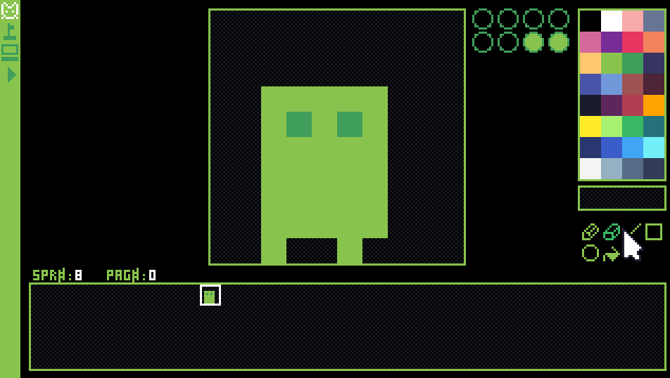

# Black-Box

This engine starts as a blank canvas, giving Lua control over display and logic

Developers can write Lua scripts to build custom tools, editors, or games.



# Download the latest release at

https://roberto-freire.itch.io/blackbox

# Publish for distribution

Visual Studio on terminal/power shell

```
dotnet publish blackbox.csproj -c Release -r win-x64 --self-contained true -p:PublishSingleFile=true
```

```
dotnet publish blackbox.csproj -c Release -r linux-x64 --self-contained true -p:PublishSingleFile=true
```

```
dotnet publish blackbox.csproj -c Release -r linux-arm64 --self-contained true -p:PublishSingleFile=true
```

Files published on folder : 

```
Game-Engine\src\framework\bin\Release\net8.0\win-x64\publish
```

```
Game-Engine\src\framework\bin\Release\net8.0\linux-arm64\publish
```

```
Game-Engine\src\framework\bin\Release\net8.0\linux-x64\publish
```

# Lua API Reference

🧩 Texture Functions

| Function                                                                                                                                                                 | Lua Alias |
| ------------------------------------------------------------------------------------------------------------------------------------------------------------------------ | --------- |
| `LoadTextureFromBase64(int index, int tileWidth, int tileHeight, string spriteBase64)`                                                                                   | `_limg`   |
| `DrawTexture(int index, int i, int x, int y, int colorIndex = -1, int transparency = 10, int w = 1, int h = 1, bool flipX = false, bool flipY = false)`                  | `_dimg`   |
| `LoadSingleImageFromBase64(int index, string spriteBase64)`                                                                                                              | `_lsimg`  |
| `DrawSingleImage(int index, int x, int y, int colorIndex = -1, int transparency = 10, bool flipX = false, bool flipY = false)`                                           | `_dsimg`  |
| `DrawSingleImageWithEffect(int index, int x, int y, double time, string parameters, int colorIndex = -1, int transparency = 10, bool flipX = false, bool flipY = false)` | `_dsimgfx`|


🗺️ Map Functions

| Function                                                                                                       | Lua Alias |
| -------------------------------------------------------------------------------------------------------------- | --------- |
| `CreateMap(int columns, int rows, int size)`                                                                   | `_cmap`   |
| `SetTileInMap(int x, int y, int tileIndex = 0)`                                                                | `_smap`   |
| `DrawMap(int mapX, int mapY, int x, int y, int width, int height, int colorIndex = -1, int transparency = 10)` | `_dmap`   |
| `UpdateTileInMap(int x0, int y0, int x1, int y1, int tileIndex = 0)`                                           | `_bmap`   |
| `GetMap()`                                                                                                     | `_gmap`   |
| `SetMap(string grid)`                                                                                          | `_lmap`   |
| `GetSpriteFromMap()`                                                                                           | `_gsprmap`   |

🏁 Flag Functions

| Function                                                                                                       | Lua Alias |
| -------------------------------------------------------------------------------------------------------------- | --------- |
| `SetFlag(int index, int flag)`                                                                   | `_sflag`   |
| `GetFlag(int index)`                                                                | `_gflag`   |
| `GetFlags()`                                                                   | `_getflags`   |
| `Loadflags()`                                                                   | `_loadflags`   |

🧮 Grid Functions

| Function                                                                                                                                             | Lua Alias     |
| ---------------------------------------------------------------------------------------------------------------------------------------------------- | ------------- |
| `NewGrid(int columns, int rows, int size, bool enableUndoRedo = false)`                                                                              | `_ngrid`      |
| `UndoGrid()`                                                                                                                                         | `_ugrid`      |
| `RedoGrid()`                                                                                                                                         | `_rgrid`      |
| `CopyGrid(int x, int y, int w, int h)`                                                                                                               | `_cgrid`      |
| `PasteGrid(int x, int y, int w, int h)`                                                                                                              | `_pgrid`      |
| `MoveGrid(int x, int y, int w, int h, int deltaX, int deltaY)`                                                                                       | `_mgrid`      |
| `SetGrid(string grid)`                                                                                                                               | `_sgrid`      |
| `GetGrid()`                                                                                                                                          | `_ggrid`      |
| `GetGridAsBase64(int x, int y, int w, int h)`                                                                                                        | `_ggrid64`    |
| `SetPixel(int x, int y, int colorIndex = -1)`                                                                                                        | `_spixelgrid` |
| `PaintBucket(int sx, int sy, int x, int y, int w, int h, int colorIndex = -1)`                                                                       | `_bgrid`      |
| `SetLine(int x0, int y0, int x1, int y1, int colorIndex = -1)`                                                                                       | `_slinegrid`  |
| `SetRect(int x0, int y0, int x1, int y1, int colorIndex = -1, bool fill = false)`                                                                    | `_srectgrid`  |
| `SetCirc(int x0, int y0, int x1, int y1, int colorIndex = -1, bool fill = false)`                                                                    | `_scircgrid`  |
| `GetPixel(int x, int y)`                                                                                                                             | `_gpixelgrid` |
| `DrawGrid(int n, int x, int y, int scale, int colorIndex = -1, int transparency = 10, int w = 1, int h = 1, bool flipX = false, bool flipY = false)` | `_dgrid`      |


🖱️ Input Functions

| Function                        | Lua Alias      |
| ------------------------------- | -------------- |
| `GetMousePos()`                 | `_mousepos`    |
| `MouseButtonPressed(int i)`     | `_mouseclick`  |
| `MouseButtonJustPressed(int i)` | `_mouseclickp` |
| `MouseButtonReleased(int i)`    | `_mouseclickr` |
| `Scroll(int i)`                 | `_mousescroll` |
| `UpdateCursor(int i)`           | `_mousecursor` |
| `JustPressed(int keyNumber)`    | `_btnp`        |
| `Released(int keyNumber)`       | `_btnr`        |
| `Pressed(int keyNumber)`        | `_btn`         |
| `GamePadJustPressed(int buttonNumber, int playerIndex = 0)`       | `_gmpdp`         |
| `GamePadReleased(int buttonNumber, int playerIndex = 0)`       | `_gmpdr`         |
| `GamePadPressed(int buttonNumber, int playerIndex = 0)`       | `_gmpd`         |


🎨 Draw Functions

| Function                                                                                         | Lua Alias     |
| ------------------------------------------------------------------------------------------------ | ------------- |
| `ShowHideMouse(bool show)`                                                                       | `_mouseshow`  |
| `DrawRect(int x, int y, int width, int height, int colorIndex = 0, int transparency = 10, int thickness = 1)`                                                                                  | `_rect`       |
| `DrawRectFill(int x, int y, int width, int height, int colorIndex = 0, int transparency = 10)`                                                                              | `_rectfill`   |
| `DrawCirc(int x, int y, int r, int colorIndex = 0, int transparency = 10)`                                                                                  | `_circ`       |
| `DrawCircFill(int x, int y, int r, int colorIndex = 0, int transparency = 10)`                                                                              | `_circfill`   |
| `DrawCirc2(int ox, int oy, int x0, int y0, int x1, int y1, int colorIndex = 0, int transparency = 10, int thickness = 1)`                                                                                 | `_circ2`      |
| `DrawCircFill2(int ox, int oy, int x0, int y0, int x1, int y1, int colorIndex = 0, int transparency = 10, int thickness = 1)`                                                                             | `_circfill2`  |
| `DrawLine(int x0, int y0, int x1, int y1, int scale = 1, int colorIndex = 0, int transparency = 10)`                                                                                  | `_line`       |
| `DrawPixel(int x, int y, int colorIndex = 0, int transparency = 10)`                                                                                 | `_pixel`      |
| `Print(string text, int x, int y, int colorIndex = 0, bool wraptext = false, int wrapLimit = 0)` | `_print`      |
| `Camera(float x = 0.0f, float y = 0.0f)`                                                         | `_camera`     |


🖥️ System Functions

| Function          | Lua Alias  |
| ----------------- | ---------- |
| `GetFps()`        | `_sysfps`  |
| `IsFocused()`     | `_isfocused` |
| `ConfigFps30()`                                                | `_fps30`    |
| `ConfigFps60()`                                                | `_fps60`    |
| `EnableCRTshader(bool value, int inner = 85, int outer = 110)` | `_crtshader`|
| `ConfigBackGroundColor(int colorIndex)`                        | `_bckgdclr` |


💾 IO File Functions

| Function                                              | Lua Alias         |
| ----------------------------------------------------- | ----------------- |
| `HasFile(string fileName)`                            | `_iohasfile`      |
| `ReadFile(string fileName)`                           | `_ioread`         |
| `CreateFile(string fileName, string content)`         | `_iocreate`       |
| `UpdateFile(string fileName, string content)`         | `_ioupdate`       |
| `DeleteFile(string fileName)`                         | `_iodelete`       |
| `CreateOrUpdateFile(string fileName, string content)` | `_iocreateorupdate` |


🔊 SFX Functions

| Function                | Lua Alias |
| ----------------------- | --------- |
| `PlaySfx(string index)` | `_psfx`   |


⏱️ Timer Functions

| Function                         | Lua Alias      |
| -------------------------------- | -------------- |
| `StartTimer(int i = 0)`          | `_stimer`      |
| `GetTimer(int i = 0, int d = 4)` | `_gtimer`      |
| `PauseGame()`          | `_pgame`       |
| `ResumeGame()`          | `_rgame`       |
| `GetDateTime(int i = 0)`         | `_gtime`       |
| `GetDeltaTime()`                 | `_gdeltatime`  |
| `GetElapsedTime()`               | `_gelapsedtime`|

# Free assets used:

- https://lospec.com/palette-list/anb16

- https://lospec.com/palette-list/sweetie-16

- https://hunteraudio.itch.io/8bit-sfx-and-music-pack