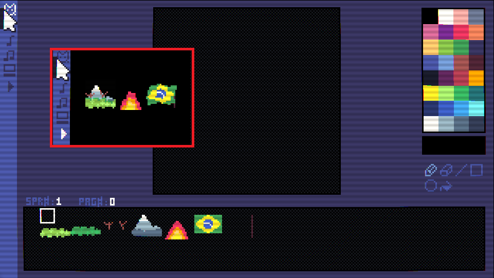

# Black-Box

This engine starts as a blank canvas, giving Lua control over display and logic

Developers can write Lua scripts to build custom tools, editors, or games.

## Legal

- How to mention Nlua and Monogame?
- Make sure there is no copyright issue with Name and/or Product/Game Engine.
- What else?

**Tutorial:**

- implement to dos written in tutorialeditor.lua

**Game:**

- implement to dos written in game.lua

**SFX:**

- music([n,] [fade_len,] [channel_mask])

**MAP:**

- Add flag functions